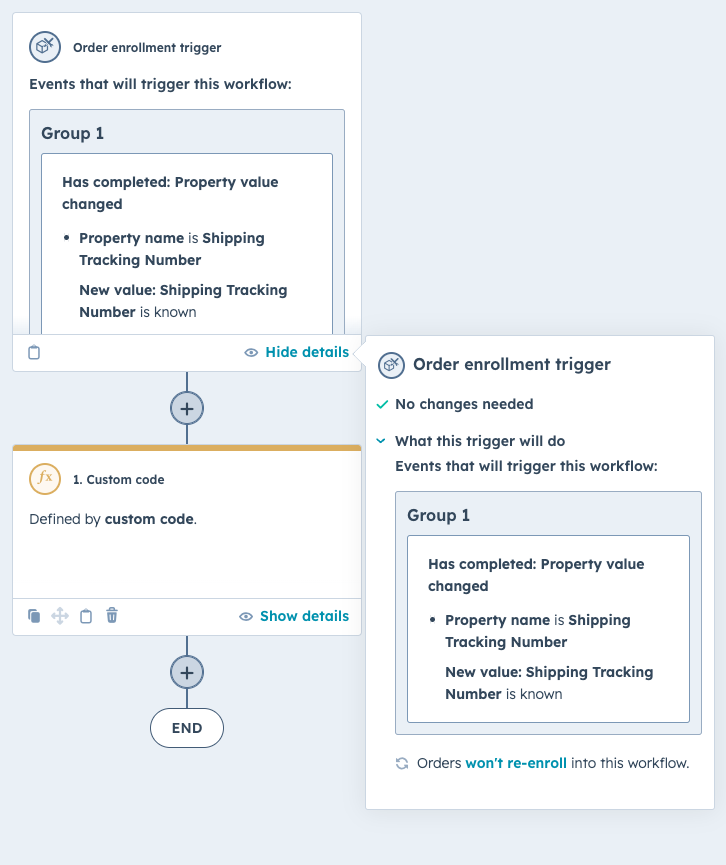
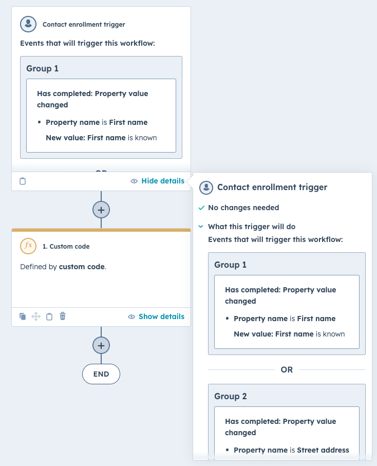

# Installation instructions for configing Adobe Commerce and Hubspot integration

## Hubspot

Hubspot is an integrated system and to connect Adobe Commerce with Hubspot you need to create integration and receive Bearer token for API connections.

### Configuration

Go to Data Management -> Integrations and create a new App.

Inside of the created app you can switch to "Auth" tab and receive Access Token.

Add to .env file of the project the following variable and add your valie here: 

```
HUBSPOT_ACCESS_TOKEN=
```

### Hubspot -> Adobe Commerce sync

Part of hubspot integration is to allow to sync back to Adobe commerce if some information being changed on Hubspot side

Currently supported:

* Customer information being changed / new customer being created
* Shipment information was added on an Order level.

To achieve it you need to have access to "Automation" configuration on Hubspot side.

This integration coming with pre-build Hubspot onboarding script.

Please run: 

```
npm run onboard-hubspot
```

This will create 2 automation scripts on Hubspot side.

#### Manual Configuration (optional)

If automated way is not an option for you, you can create them manually.

On Hubport pls go to Automations -> Workflows -> Create a Workflow from scratch

##### Shipment sync

For shipment sync pls choose "Order" as main automation object.

Create the following automation: 



Custom script you can find:

```
scripts/lib/hubspot/workflow_shipment.js
```

##### Customer sync

For shipment sync pls choose "Customer" as main automation object.

Create the following automation: 



Pls create group for each of attribute changed: 

* firstname
* lastname
* email
* city
* country
* zip
* address
* state

Custom script you can find:

```
scripts/lib/hubspot/workflow_customer.js
```
